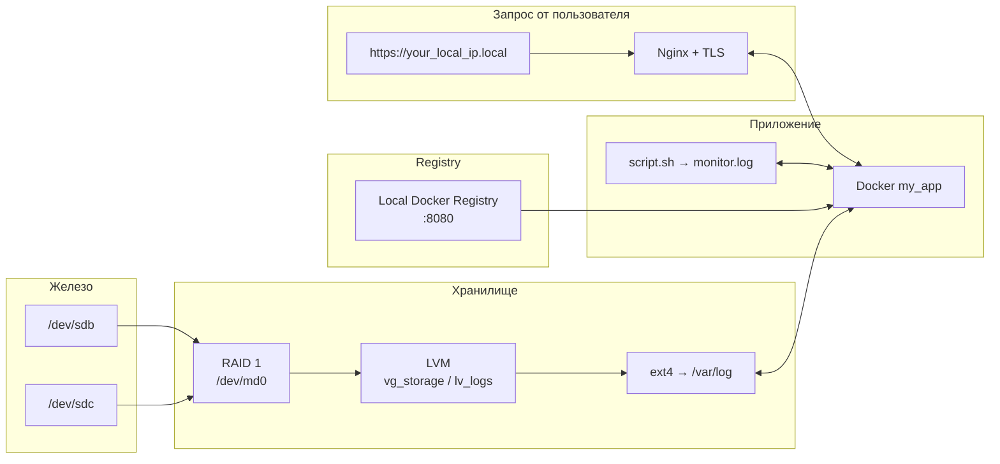

В репозитории представлен простой проект с контейнеризированным скриптом `script.sh`, который снимает логи состояния контейнера и записывает их в файл `monitor.log`. Сервис `my_app` собирается в Docker-образ и хранится в локальном Docker Registry. Всё разворачивается автоматически одним скриптом bootstrap.sh — от настройки дисков до HTTPS-доступа к приложению.

- Архитектура приложения:


- `bootstrap.sh` автоматизирует процесс сборки и установки необходимого ПО:
```bash
# переходим в директорию проекта
cd my-sysadmin-scripts/

# Заполнение параметров
lsblk
NAME                   MAJ:MIN RM  SIZE RO TYPE  MOUNTPOINTS
sda                      8:0    0   25G  0 disk
├─sda1                   8:1    0    1M  0 part
└─sda2                   8:2    0   25G  0 part  /
sdb                      8:16   0   10G  0 disk # Свободное устройство 1
sdc                      8:32   0   10G  0 disk # Свободное устройство 2
sr0                     11:0    1 1024M  1 rom

# Далее задаем их в переменных bootstrap.sh
disk_1="/dev/sdb" 
disk_2="/dev/sdc"
raid_name="/dev/md0" # название RAID массива
vg_name="vg_storage" # название пула хранения 
lv_name="lv_logs" # название логического раздела
```

- Выдаем права на запуск скрипта и вводи пароль sudo:
```bash
chmod +x bootstrap.sh
./bootstrap.sh
[sudo] password for your_user:
```

- После выполнения скрипта, можно запустить скрипт `test.sh` для локальных проверок и изучения проекта:
```bash
chmod +x test.sh
./test.sh
```
